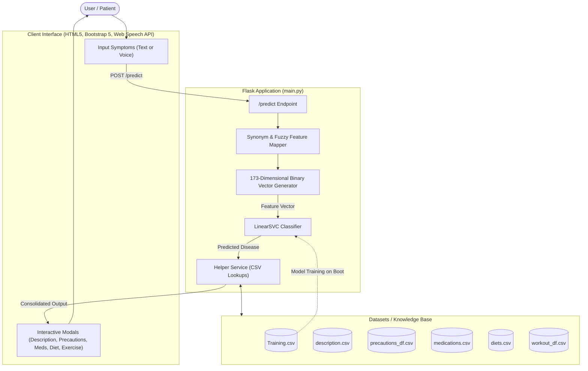

# SymptoCheck - AI-Powered Medical Symptom & Disease Prediction Assistant

[](https://www.python.org/)
[](https://flask.palletsprojects.com/)
[](https://scikit-learn.org/)
[](https://getbootstrap.com/)
[](LICENSE)

**SymptoCheck** is an end-to-end intelligent healthcare web application designed to bridge the gap between preliminary symptom awareness and actionable health guidance. Powered by Machine Learning (**Linear Support Vector Classification**) and a **Flask** backend, the system analyzes user-submitted symptoms (via text or voice dictation) to predict the most probable disease and delivers a comprehensive 360° health management plan including descriptions, precautions, medications, workouts, and dietary advice.

---

## 📑 Table of Contents

- [Overview](#-overview)
- [Key Features](#-key-features)
- [System Architecture](#-system-architecture)
- [Machine Learning Pipeline](#-machine-learning-pipeline)
- [Tech Stack](#-tech-stack)
- [Project Directory Structure](#-project-directory-structure)
- [Installation & Setup](#-installation--setup)
- [How to Run the Application](#-how-to-run-the-application)
- [Application Flow & Usage](#-application-flow--usage)
- [Screenshots & UI Showcase](#-screenshots--ui-showcase)
- [Disclaimer & Medical Ethics](#-disclaimer--medical-ethics)
- [Future Enhancements](#-future-enhancements)

---

## 🌟 Overview

Navigating sudden illnesses or symptoms can often be overwhelming. SymptoCheck provides a modern, intuitive, and accessible interface where individuals can describe what they are feeling in everyday language. 

The application matches user inputs against a clinical symptom taxonomy (170+ recognized symptoms), predicts potential medical conditions, and immediately provides:
1. **Disease Description:** Plain-language overview of the diagnosed condition.
2. **Precautions:** Actionable steps to mitigate symptoms and prevent complications.
3. **Medications:** Common pharmacological interventions (with cautionary guidance).
4. **Workout & Physical Care:** Tailored exercises and movement recommendations.
5. **Dietary Recommendations:** Nutritional guidance to promote recovery and overall health.

---

## ✨ Key Features

- 🧠 **Supervised Machine Learning:** Utilizes a high-accuracy `LinearSVC` (Linear Support Vector Classifier) model trained on multi-feature medical datasets.
- 🗣️ **Voice-to-Text Dictation:** Integrates the browser's native **Web Speech API** for hands-free symptom input.
- 🔍 **Natural Language & Synonym Mapping:** Intelligent preprocessing maps everyday phrases (e.g., *"head pain"*, *"upset stomach"*, *"racing heart"*, *"coughing"*) directly to standardized clinical feature keys.
- 📊 **Holistic Health Output:** Returns more than just a diagnosis—provides comprehensive lifestyle, diet, precaution, and medication recommendations via interactive modal overlays.
- 🎨 **Modern & Responsive UI:** Clean glassmorphism aesthetic built using Bootstrap 5, FontAwesome icons, custom animations, and mobile-first responsiveness.
- 🛡️ **Robust Error Handling:** Validates symptom queries, handles missing features gracefully, and provides meaningful user feedback on typos or unrecognized inputs.

---

## 📐 System Architecture



---

## 🔬 Machine Learning Pipeline

1. **Dataset Ingestion:**
   - Ingests `Training.csv` containing multi-class medical prognoses across 170+ binary symptom features.
   - Cleans and normalizes feature headers (lowercasing, whitespace trimming, regex sanitation).
2. **Feature Alignment:**
   - Builds an indexed feature vector of 173 unique symptoms.
   - Handles dataset discrepancies dynamically to avoid mismatch issues.
3. **Training & Validation:**
   - Splits data using stratified train/test partitioning (80/20).
   - Trains a `LinearSVC` (Linear Support Vector Classifier) configured with `max_iter=10000` and reproducible random state.
   - Evaluates test accuracy automatically upon application boot.
4. **Inference & Synonym Resolution:**
   - Patient inputs are tokenized and processed against a comprehensive lookup dictionary mapping common expressions to standardized symptoms.
   - Synthesizes an inference vector and returns top prediction.

---

## 💻 Tech Stack

- **Backend Framework:** Python, [Flask](https://flask.palletsprojects.com/)
- **Machine Learning & Data Processing:** [Scikit-Learn](https://scikit-learn.org/), [Pandas](https://pandas.pydata.org/), [NumPy](https://numpy.org/)
- **Frontend & Styling:** HTML5, CSS3, [Bootstrap 5](https://getbootstrap.com/), [FontAwesome](https://fontawesome.com/)
- **Speech API:** Browser Web Speech API (`webkitSpeechRecognition`)
- **Data Formats:** Relational CSV databases

---

## 📁 Project Directory Structure

```text
Sympto Check/
│
├── datasets/                          # Medical knowledge base & training records
│   ├── Training.csv                   # Main clinical training dataset with binary symptoms
│   ├── Symptom-severity.csv           # Relative severity rankings for symptoms
│   ├── description.csv                # Detailed disease explanations
│   ├── diets.csv                      # Recommended diets per condition
│   ├── medications.csv                # Pharmacological recommendations
│   ├── precautions_df.csv             # 4-stage precaution checklists per disease
│   ├── symtoms_df.csv                 # Auxiliary symptom mapping data
│   └── workout_df.csv                 # Exercise and physical therapy regimens
│
├── static/                            # Static media and brand assets
│   ├── Sympto.png                     # Application brand logo
│   └── example logo.png               # Banner/branding image
│
├── templates/                         # Jinja2 HTML templates
│   ├── index.html                     # Main interactive health diagnosis dashboard
│   ├── about.html                     # Mission statement and project overview
│   ├── contact.html                   # Contact and support form
│   ├── blog.html                      # Healthcare insights and articles
│   └── developer.html                 # Developer & technical credits
│
├── main.py                            # Flask server, ML training pipeline, & API routes
├── requirements.txt                   # Project dependencies
└── README.md                          # Comprehensive project documentation
```

---

## ⚙️ Installation & Setup

### Prerequisites
- **Python 3.9+** installed on your system.
- Recommended: A modern browser (Google Chrome or Microsoft Edge) for full Web Speech Recognition support.

### 1. Clone or Download the Repository
```bash
git clone https://github.com/yourusername/sympto-check.git
cd "Sympto Check"
```

### 2. Create a Virtual Environment
```bash
# Windows
python -m venv .venv
.venv\Scripts\activate

# macOS / Linux
python3 -m venv .venv
source .venv/bin/activate
```

### 3. Install Dependencies
```bash
pip install -r requirements.txt
```

---

## 🚀 How to Run the Application

Start the Flask development server:
```bash
python main.py
```

Once the server initializes and the model reports test accuracy in the terminal:
```text
[Model Training] Test accuracy: 1.0000
 * Running on http://127.0.0.1:5000
```
Open your browser and navigate to:
```
http://127.0.0.1:5000/
```

---

## 🩺 Application Flow & Usage

1. **Enter Symptoms:**
   - **Text Input:** Type symptoms separated by commas (e.g., `itching, skin rash, fatigue` or `headache, high fever, chills`).
   - **Voice Input:** Click the **Voice Input** button, allow microphone access, and speak symptoms clearly.
2. **Analyze:**
   - Click **Analyze Symptoms**.
3. **Review Results:**
   - View the predicted medical condition.
   - Click the interactive modal buttons:
     - ℹ️ **Description** to understand the disease.
     - 🛡️ **Precautions** for essential dos and don'ts.
     - 💊 **Medications** for pharmacological references.
     - 🏋️ **Workouts** for physical activity recommendations.
     - 🥗 **Diet Plan** for nutrition guides.

---

## ⚠️ Disclaimer & Medical Ethics

> **IMPORTANT MEDICAL NOTICE:**
> SymptoCheck is an experimental, AI-based informational tool developed for educational and research purposes. It **does not** provide official medical diagnoses, clinical determinations, or professional medical advice. Always consult a qualified physician or healthcare specialist regarding any medical condition or before starting any medication, diet, or treatment plan.

---

## 🔮 Future Enhancements

- [ ] **Model Serialization:** Cache trained models via `joblib`/`pickle` for instant server startup.
- [ ] **Symptom Severity Index:** Calculate an overall patient risk score using `Symptom-severity.csv`.
- [ ] **Doctor Locator Integration:** Connect patients with nearby verified clinics or telemedicine providers.
- [ ] **Multi-Language Support:** Expand speech recognition and interface translation to Spanish, Hindi, and other languages.
- [ ] **PDF Health Summary Export:** Allow patients to download a printable report for doctor visits.

---

## 📄 License

This project is licensed under the [MIT License](LICENSE) - feel free to adapt and build upon it for learning and development.
